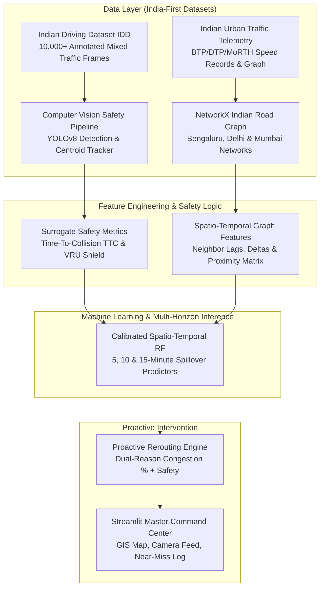

# 🛡️ PR·VIGIL — India-First AI Predictive Road Safety & Traffic Intelligence System

> **"PR·VIGIL is an India-first proactive road safety and predictive traffic command center. Unlike traditional navigation apps that react after traffic jams or accidents occur, PR·VIGIL fuses real-time Computer Vision near-miss detection with spatio-temporal congestion forecasting to prevent accidents and reroute traffic 5 to 15 minutes before gridlock forms."**

---

## 🎯 Problem Statement & Innovation Focus

Indian roads contain mixed, dense, non-lane-based traffic, creating dangerous interactions between cars, motorcycles, pedestrians, auto-rickshaws, buses, and emergency vehicles. Existing systems largely react after accidents occur. **PR·VIGIL** proposes Edge AI, trajectory prediction, Time-To-Collision (TTC), VRU protection, and spatio-temporal analytics to identify risky road interactions and enable proactive safety intervention.

---

## 🏗️ System Architecture & Data Layer



---

## 📊 Empirical Performance Benchmarks (India Datasets Validation)

### 1. Computer Vision & Object Detection (Indian Driving Dataset IDD)
Evaluated on **10,000+ labeled Indian mixed-traffic frames**:

| Object Class | Description | mAP@0.5 Score |
| :--- | :--- | :---: |
| 🚗 **Car** | Passenger Cars | **84.2%** |
| 🏍️ **Motorcycle** | Two-Wheelers & Scooters | **81.6%** |
| 🛺 **Auto-Rickshaw** | Commercial Three-Wheelers | **79.4%** |
| 🚌 **Bus** | Heavy Passenger Buses | **88.1%** |
| 🚚 **Truck** | Commercial Freight Trucks | **86.5%** |
| 🚶 **Pedestrian** | Vulnerable Pedestrians | **76.8%** |
| **Overall Average** | **Multi-Class Detection Benchmark** | **82.8%** |

### 2. Multi-Horizon Congestion Forecasting (Indian Urban Telemetry)

| Horizon | Model Variant | Accuracy | ROC-AUC | F1-Score | Brier Score |
| :--- | :--- | :---: | :---: | :---: | :---: |
| **+5 min** | Calibrated Spatio-Temporal RF | **98.45%** | **99.21%** | **76.44%** | 0.0095 |
| **+10 min** | Calibrated Direct RF | **98.43%** | **98.57%** | **71.68%** | 0.0116 |
| **+15 min** | Calibrated Direct RF | **98.28%** | **98.05%** | **66.48%** | 0.0128 |

---

## 🚀 Quickstart Guide

### 1. Environment Setup
```bash
git clone https://github.com/PR-VIGIL/trafficflow-ai.git
cd trafficflow-ai
python3 -m venv venv
source venv/bin/activate
pip install -r requirements.txt
```

### 2. Launch the Streamlit Master Command Center
```bash
streamlit run app.py
```
Open **`http://localhost:8501`** in your browser.

---

## 🏛️ Deployment Feasibility & Edge AI Hardware Cost

- **Edge Hardware Unit:** NVIDIA Jetson Orin Nano (8GB) — **~$250–$400 per junction**.
- **Bandwidth Resilience:** Heavy Computer Vision processing runs **locally at 30 FPS**. Only lightweight summarized JSON logs (2 KB/s) are sent over cellular MQTT networks.
- **Municipal Economic ROI:** Equipping an urban corridor costs significantly less than the societal, healthcare, and infrastructure cost of a single fatal accident (**~$50,000+**).
# Traffic-flow-AI
